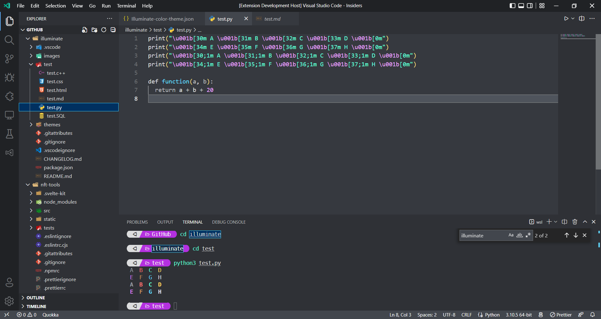

# 

A theme with luminous syntax highlighting.

## Preview

## Contribute

Please wait for the v1.0.0 release before contributing.

## Donations

If you like my open source projects and would like to support my work, you can help me to cover gas on MetaMask at `0x17b69dbc1E956b2fEfE6C97f556c84eb346772F0`.
