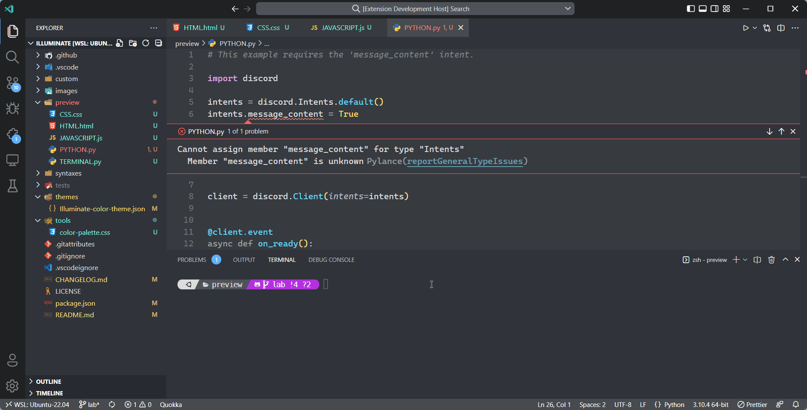
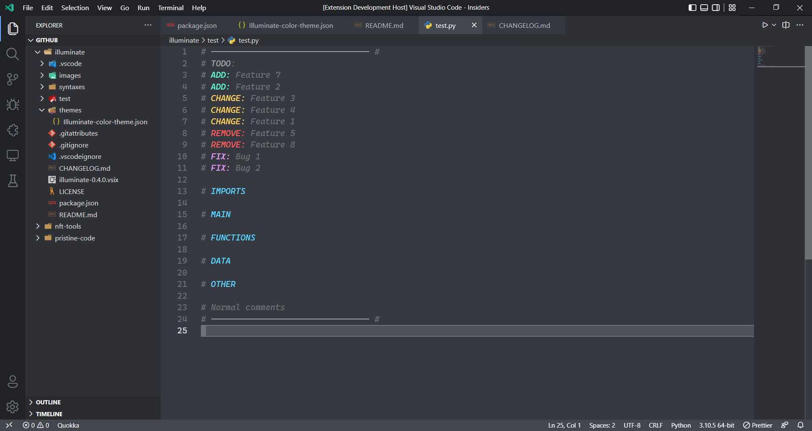

<!-- BANNER -->

# 

<!-- SHIELDS -->

<!-- DESCRIPTION -->

A color theme for Visual Studio Code with luminous syntax and comments highlighting.

The theme uses all the scopes mentioned [here](https://code.visualstudio.com/api/references/theme-color).

<!-- CONTENTS -->

## Contents

1. [Preview](#preview)
   - [Syntax Highlighting](#syntax-highlighting)
   - [Comments Highlighting](#comments-highlighting)
2. [Color Palette](#color-palette)
3. [Contribute](#contribute)
4. [License](#license)
5. [Contact](#contact)

<!-- PREVIEW -->

## Preview

### Syntax Highlighting

### Comments Highlighting

<!-- COLOR PALETTE -->

## Color Palette

All the colors used in this color theme can be found [here](tools/color-palette.css).

<!-- CONTRIBUTING GUIDE -->

## Contribute

Contributions are always welcome! Please check the [Contributing Guide](.github/CONTRIBUTING.md) to get started.

Please adhere to the [Code of Condcut](.github/CODE_OF_CONDUCT.md).

<!-- LICENSE -->

## License

Distributed under the [MIT License](LICENSE).

<!-- CONTACT DETAILS -->

## Contact

Email at psichi1337@outlook.com.
